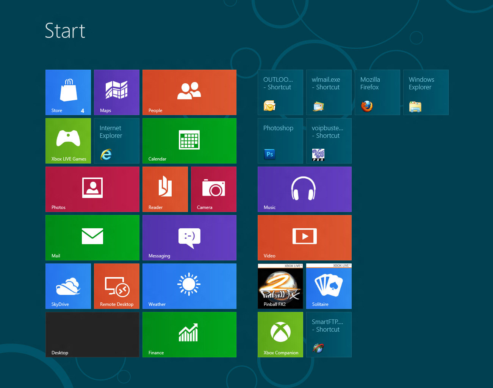

# [fit] Mobile 
# [fit] Publishing

---

# About me
-
## Bjoern Zapadlo
## Konstanz
## 37 Jahre
## Laufen / Fotografie


---

# Berufliches
Head of Engineering @ HolidayCheck

Informatik Studium 1999 - 2002
3 Agenturen in Stuttgart

Dozent an der SAE, Dualen Hochschule Stuttgart, Hochschule Furtwangen

PHP, Java, Scala, Javasccript, CSS, Html,MySQL, MongoDB, Elasticsearch, ...

---

#CONTACT ME
bjoern.zapadlo@gmail.com<br>
http://www.zapadlo.de

@BjoeZap

https://www.xing.com/profile/Bjoern_Zapadlo<br>
http://de.linkedin.com/pub/bjoern-zapadlo/36/889/1a5

Facebook


---


---


---

## Größtes deutsches Meinungsportal für Reise und Urlaub
## Vermittlung von Reisen
## Schweiz & München
## Existiert seit 1999
## Über 300 Mitarbeiter

---


# [fit] http://careers.holidaycheck.com/

---

# [fit] Und ihr?
## Name
## Erwartungen / Wünsche

---

# [fit] Orga
## Skript
## Pausen
## Sonstiges

---

# Agenda
- Mobilfunk
- Mobiles Internet
- Kommunikationsstrategien
- Native Apps
- EBooks
- Entwicklung für mobile

---

# [fit] Mobilfunk

---

# Definition
Mobilfunk ist die Sammelbezeichnung für den Betrieb von beweglichen Funkgeräten.

Darunter fallen vor allem tragbare Telefone, (Mobiltelefone, siehe auch: Mobilfunknetz) und in Fahrzeuge eingebaute Wechselsprechgeräte (etwa Taxifunk). Es existieren jedoch viele weitere Anwendungsbereiche, wie zum Beispiel mobile Datenerfassung, Funkrufdienste, Telemetrie, See- und Binnenschifffahrtfunkdienste, Jedermannfunk und Amateurfunk, die nicht ortsgebunden sind.

Die deutsche Bundesnetzagentur spricht von Öffentlichen zellularen Mobilfunkdiensten.

---

# [fit] Geschichte

---


---


# Analog

- 1926 Vorläufer: handvermittelten Zugfunk im F-Zug Berlin – Hamburg
- 1958 - 1977: A-Netz der Deutschen Bundespost (ca. 10.500 TN)
- 1972 - 1995: B-Netz (ca. 27.000 TN).
- 1984 - 2000: C-Netz (zellulares Mobilfunknetz) (ca. 850.000 TN)

---


# Digital

- 1992: D-Netz von der Telekom-Tochter DeTeMobil 
- 1993: E-Netz von E-Plus
- 2000: GPRS (WAP)
- 2002: GSM-R auf der Schnellfahrstrecke Köln–Rhein/Main von der Deutschen Bahn
- 2004: UMTS (3G)
- 2006: EDGE
- 2010: vierten Generation (LTE)
- 2011: HSPA

---

# [fit] Wie funktioniert
# [fit] Mobilfunk?

---


---

# [fit] Technische 
# [fit] Grundlagen

---


# Mobilfunk ist Digital

Es werden also Nullen und Einsen übertragen. Egal, ob Sprache oder Daten. Sprache wird digitalisiert und später beim Gesprächspartner wieder in analoge Signale zurück gewandelt.

---

# Aufbau - Funkzellen
- zellularer Aufbau
- nebeneinanderliegenden, wabenartig vernetzten Funkzellen
- Größe unterschiedlich: „Small Cells“ (5 - 10m) bis zu 5 - 10 km in dünn besiedelten Gebieten
- Begrenzung durch Anzahl der Teilnehmer und Topografie bzw. Bebauung

---

## Jede Funkzelle verfügt über eine Sende- und Empfangsstation, die sogenannte Mobilfunkbasisstation.

---

# Handover

Als Handover oder Verbindungsübergabe (engl. Handover – Ablieferung, Übergabe) bezeichnet man einen Vorgang in einem mobilen Telekommunikationsnetz (zum Beispiel GSM oder UMTS), bei dem das mobile Endgerät (Mobilstation) während eines Gesprächs oder einer Datenverbindung ohne Unterbrechung dieser Verbindung von einer Funkzelle in eine andere wechselt. Im US-amerikanischen Sprachgebrauch ist der Begriff Handoff geläufiger.

---

# Handover
- Endgerät führt ständig Messungen der Signalstärke und -qualität der aktuellen Zelle sowie der Feldstärke der Nachbarzellen durch. Bei GSM: Empfangssignalstärke des Broadcast Control Channel (BCCH)
- Messergebnisse werden an den Base Station Controller (BSC) gesendet (bei GSM alle 480 ms)
- Im BSC wird dann die Entscheidung über die Notwendigkeit eines Handovers getroffen.
- Kanalreservierung in Zielzelle durch BSC, danach Übermittlung des Handover-Befehls an Mobilstation

---

# Roaming
Der Begriff Roaming (englisch für „herumwandern“, „streunen“ oder „herumstreifen“) ist die Fähigkeit eines Mobilfunknetz-Teilnehmers, in einem anderen Netzwerk als seinem Heimnetzwerk selbsttätig Anrufe zu empfangen oder zu tätigen, Daten zu schicken und zu empfangen oder Zugriff auf andere Mobilfunknetzdienste zu haben. Der Begriff steht synonym mit der Handynutzung im Ausland, wo das eigene Heimnetzwerk nicht zur Verfügung steht. Dies funktioniert sowohl im GSM-Standard, wo der Begriff eingeführt wurde, als auch im UMTS- und LTE-Standard Die Einsatzbereitschaft der Endgeräte außerhalb des eigenen Funknetzes wird durch Authentisierung, Autorisierung und Verrechnungsverfahren (Billing) technisch unterstützt.

---

# Frequenzen
## Deutschland
### GSM 900 - 890 bis 915 & 935 bis 960 MHz
### GSM 1800 - 1.710 bis 1.785 & 1.805 bis 1.880 MHz
### UMTS - 1.920 bis 1.980 & 2.110 bis 2.170 MHz
### LTE - 700 & 800 MHz und 1,8, 2 & 2,6 GHz

---

## Früher waren die Frequenzen aufgeteilt zwischen D (GSM 900) und E Netz (GSM 1800)
## Zur Nutzung beider Bänder benötigt man ein Dualband-Handy

^ Heute ist jedes verkaufte Handy mindestens ein Dualband-Handy

---

## Unterschiedliche Frequenzen ermöglichen gleichzeitiges Nutzen verschiedener Dienste.
## Es kann also sein, dass Sprache funktioniert, während mobiles Internet nicht funktioniert.

---

# Je mehr Daten übertragen werden, umso "enger" wird es in der jeweiligen Frequenz.

^ Rohranalogie => Rohr aufmalen

---

# AKA Bandbreite

Die Bandbreite ist eine Kenngröße in der Signalverarbeitung, die die Breite des Intervalls in einem Frequenzspektrum festlegt, in dem die dominanten Frequenzanteile eines zu übertragenden oder zu speichernden Signals liegen. Die Bandbreite ist durch eine untere und eine obere Grenzfrequenz charakterisiert, wobei je nach Anwendung unterschiedliche Festlegungen der beiden Grenzwerte existieren und somit je nach Zusammenhang unterschiedliche Bandbreiten als Kennwert existieren.

---

# Frequenzen
## USA
### GSM - 850 & 1900 MHz
### UMTS / LTE - 850, 1800 & 1900 MHz

---

# Daher braucht man in den USA ein kompatibles Telefon (Tri- oder Quadband-Handy)

---

# SMS
Short Message Service (englisch für Kurznachrichtendienst, Abk. SMS) ist ein Telekommunikationsdienst zur Übertragung von Textnachrichten, die meist Kurzmitteilungen oder ebenfalls SMS genannt werden. Er wurde zuerst für den GSM-Mobilfunk entwickelt.

- Max. 160 Zeichen
- Erste Versendung 1992
- Nachfolgedienste sind Multimedia Messaging Service (MMS) und Joyn

---

.png)

---


---

# IMSI
Die **International Mobile Subscriber Identity** (IMSI; deutsch Internationale Mobilfunk-Teilnehmerkennung) dient in GSM-, UMTS- und LTE-Mobilfunknetzen der eindeutigen Identifizierung von Netzteilnehmern (interne Teilnehmerkennung). Neben weiteren Daten wird die IMSI auf einer speziellen Chipkarte gespeichert, dem SIM (Subscriber Identity Module). Die IMSI-Nummer wird weltweit einmalig pro SIM von den Mobilfunknetzbetreibern vergeben. Dabei hat die IMSI nichts mit der Telefonnummer zu tun, die der SIM-Karte zugeordnet ist.

---

# Authentifizierung
Jedem Teilnehmer wird bei der Aufnahme in das Netz eines Mobilfunkbetreibers ein 128 Bit langer Subscriber Authentication Key zugeteilt. Der Schlüssel wird auf Teilnehmerseite in der SIM-Karte als auch netzseitig gespeichert

---

# Nutzdatenverschlüsselung
- Telefongespräche sind in Deutschland verschlüsselt
- Einfaches abhören ist daher nicht möglich
- Der Verschlüsselungsalgorithmus ist aber nicht sicher
- In anderen Ländern (z.B. Indien) darf das Handy-Netz nicht verschlüsselt werden

---

# Anonymisierung
Um eine gewisse Anonymität zu gewährleisten, wird die eindeutige Teilnehmerkennung IMSI, über die ein Teilnehmer weltweit eindeutig zu identifizieren ist, auf der Luftschnittstelle verborgen. Stattdessen wird eine temporäre ID generiert, die bei jedem Location Update neu vergeben wird und nur verschlüsselt übertragen wird.

---

# Benutzerauthentisierung
Der Benutzer muss sich gegenüber der SIM-Karte (und damit gegenüber dem Mobilfunknetz) als berechtigter Nutzer authentisieren. Dies geschieht mittels einer PIN. Es ist auf der SIM-Karte festgelegt, ob die PIN-Abfrage deaktiviert werden kann. Wurde die PIN dreimal in Folge falsch eingegeben, wird die SIM-Karte automatisch gesperrt. Um sie wieder zu entsperren, ist der PUK (Personal Unblocking Key) erforderlich. Der PUK kann zehnmal in Folge falsch eingegeben werden bevor die SIM-Karte endgültig gesperrt wird. Das Mobilfunknetz muss sich nicht gegenüber dem Benutzer authentisieren.

---

# Cell Broadcast
Cell Broadcast oder Cell Broadcasting (kurz CB) ist ein Mobilfunkdienst zum Versenden von Kurzmitteilungen. Anders als bei der SMS-Nachricht, die nur an einen bestimmten Empfänger gerichtet ist, wird eine CB-Nachricht von der Basisstation an alle Geräte geschickt, die diesen Dienst aktiviert haben und sich in derselben Funkzelle befinden.

---

# GSM-Ortung
GSM-Ortung bezeichnet die Ortsbestimmung eines eingeschalteten und in ein Funknetz eingebuchten, auf der Basis von Global System for Mobile Communications (GSM) betriebenen Endgerätes (Mobiltelefon) durch das Mobilfunknetz.

- Anwedungsfälle: LBS, Ortung verlorenerer Endgeräte, Notrufe, Ermittlung durch Polizei, Zoll, ...
- Verschiedene Möglichkeiten: Zelle, Laufzeitmessung, GPS, "Stille SMS"
- Genauigkeit zwischen mehreren Kilometern bis unter 5 m 

---

# Latenz
- Verzögerung vom Senden eines Ereignisses bis zum Empfang
- Ausgelöst durch Laufzeit des Signals, Kodierung, ...
- "Der Ping ist schlecht ..." ;)
- Probleme vorallem bei Echtzeit Anwednugn wie zum Beispiel Sprache

---

# Verfügbarkeit / Netzabdeckung
- Abhängig von Basisstationen und topografischen Gegebenheiten
- Unterschiede zwischen Sprache und Internet in versch. Qualitäten
- Bester Ausbau in Gebieten mit vielen Menschen

---

# Netzabdeckung in Deutschland

- [T-Mobile](https://www.t-mobile.de/netzausbau/0,25250,15400-_,00.html)
- [Vodafone] (http://www.vodafone.de/privat/hilfe-support/netzabdeckung.html)
- [Telefonica aka E-Plus & O2] (http://geoinfo.eplus.de/evinternet/)

---

# [fit] Standards

---

# GSM

Das **Global System for Mobile Communications*** ist ein Standard für volldigitale Mobilfunknetze, der hauptsächlich für Telefonie, aber auch für leitungsvermittelte und paketvermittelte Datenübertragung sowie Kurzmitteilungen (Short Messages) genutzt wird. 

- Aka 2G
- Nachfolger der analogen Netzte (A-C Netz)
- Langsame Datenübertragung möglich: 9,6 bis 14,4 kbit/s

---

# GSM-R

Global System for Mobile Communications – Rail(way) (GSM-R oder GSM-Rail) ist ein Mobilfunksystem, das auf dem weltweit dominierenden Funkstandard GSM aufbaut, jedoch für die Verwendung bei den Eisenbahnen angepasst wurde. In Deutschland wurde damit der auf analoger Technik basierende Zugfunk abgelöst. GSM-R wird daher auch als digitaler Zugfunk bezeichnet.


2016 waren im Netz der Deutschen Bahn rund 29.000 von gut 33.000 Streckenkilometern mit GSM-R ausgerüstet. Auf den übrigen Strecken läuft die Kommunikation über analogen Zugfunk oder das öffentliche GSM-Netz.

---

# BOS-GSM

BOS-GSM ist eine Technik zur digitalen Funkkommunikation von Anwendern mit besonderen Sicherheitsanforderungen wie Behörden und Organisationen mit Sicherheitsaufgaben (BOS: Polizei, Feuerwehr, Rettungsdienste).

Die geplante Variante des öffentlichen GSM-Digitalfunknetzes war von einigen Digitalfunk-Netzbetreibern als Alternative zu den spezialisierten Funknetzen nach den Standards TETRA und Tetrapol angeboten worden. Mit Hilfe von sogenannten ASCI-Features (Advanced Speech Call Items) wird das öffentliche GSM-Netz dabei um besondere Sicherheitsfunktionen erweitert, so die Priorisierung von Anrufen sowie Funktionen für geschlossene Benutzergruppen. Private Nutzer des GSM-Netzes würden im Notfall aus dem Netz gedrängt, um die Leistungsfähigkeit des Netzes zu erhalten.

---

# GPRS

**General Packet Radio Service, abgekürzt GPRS (deutsch: „Allgemeiner paketorientierter Funkdienst“)** ist die Bezeichnung für den paketorientierten Dienst zur Datenübertragung in GSM-Netzen.

Wenn GPRS aktiviert ist, besteht nur virtuell eine dauerhafte Verbindung zur Gegenstelle (sog. Always-on-Betrieb). Erst wenn wirklich Daten übertragen werden, wird der Funkraum besetzt, ansonsten ist er für andere Benutzer frei. Deshalb braucht kein Funkkanal dauerhaft (wie bei CSD) für einen Benutzer reserviert zu werden. Deshalb werden die Kosten für GPRS-Verbindungen üblicherweise nach übertragener Datenmenge berechnet.

Ungefähr seit dem Jahr 2000 unterstützen viele Mobiltelefone GPRS, etwa für die Betrachtung von WAP-Seiten und für Multimedia Messaging Service (MMS).

---

# WAP

Das **Wireless Application Protocol (WAP)** bezeichnet eine Sammlung von Techniken und Protokollen, deren Ziel es ist, Internetinhalte für die langsamere Übertragungsrate und die längeren Antwortzeiten im Mobilfunk sowie für die kleinen Displays der Mobiltelefone verfügbar zu machen. Verschiedene WAP-Implementierungen standen damit in direktem Wettbewerb zum i-mode-Dienst. Aufgrund seiner Komplexität, schnelleren Verbindungen und HTML-fähiger Mobilgeräte ist WAP heute weitgehend überholt.

---

# WML

Die Wireless Markup Language (WML) ist eine XML-basierte Seitenbeschreibungssprache, die eine stark reduzierte Fassung von HTML darstellt. WML wurde zur Darstellung veränderlicher Inhalte auf Mobiltelefonen entwickelt; es ist Teil des Wireless Application Protocol (WAP). Im Gegensatz zu HTML wird WML-Code vor dem Versenden zuerst in einen speziellen Binärcode umgewandelt, welcher dann an das Mobiltelefon gesendet wird. Bei älteren Handys mit wenig Speicherplatz ist die Größe einer WML-Datei auf 1600 Byte beschränkt; inzwischen spielt diese Grenze praktisch aber kaum noch eine Rolle.

---


---

# EDGE

**Enhanced Data Rates for GSM Evolution (EDGE)** bezeichnet eine Technik zur Erhöhung der Datenübertragungsrate (bis zu 473 kbit/s) in GSM-Mobilfunknetzen durch Einführung eines zusätzlichen Modulationsverfahrens. Mit EDGE werden die Datendienste GPRS zu E-GPRS (Enhanced GPRS) und HSCSD zu ECSD erweitert.

EDGE stellt dabei eine Weiterentwicklung der GSM-Technik dar. Es ist im Grunde ein GSM mit mehr Bits pro Symbol, also höhere Bitrate. EDGE lässt sich mit mäßigem Aufwand in die Mobilfunknetze integrieren.

---

# HSCSD

**High Speed Circuit Switched Data (HSCSD)**, deutsch etwa schnelle leitungsvermittelte Datenübertragung, ist eine Erweiterung des GSM-Mobilfunk-Standards CSD, um schnellere Datenübertragung zu erreichen. Durch Bündelung mehrerer Datenkanäle können theoretisch Datenübertragungsraten bis etwa 115,2 kbit/s (= 8 × 14,4 kbit/s) erreicht werden.

Technisch handelt es sich um eine Bündelung mehrerer benachbarter Zeitschlitze auf eine logische Verbindung. Im GSM werden je Frequenz acht Zeitschlitze zeitversetzt übertragen. Theoretisch könnten alle acht Funkschlitze einer Verbindung zugeordnet werden.

---

# UMTS (3G)
Das **Universal Mobile Telecommunications System (UMTS)** ist ein Mobilfunkstandard der **dritten Generation (3G)**, mit dem deutlich höhere Datenübertragungsraten (bis zu 42 Mbit/s mit HSPA+, sonst max. 384 kbit/s) als mit dem Mobilfunkstandard der zweiten Generation (2G), dem GSM-Standard (bis zu 220 kbit/s bei EDGE, sonst max. 55 kbit/s bei GPRS), möglich sind.

---

# HSDPA
**High Speed Downlink Packet Access (HSDPA, 3.5G, 3G+ oder UMTS-Broadband)** ist ein Datenübertragungsverfahren des Mobilfunkstandards UMTS, das vom 3rd Generation Partnership Project definiert wurde. Das Verfahren ermöglicht DSL-ähnliche Datenübertragungsraten im Mobilfunknetz.

Die maximale Datenrate ist durch die sogenannte Kategorie des Empfängers beschränkt. Typisch sind 3,6 Mbit/s und 7,2 Mbit/s. 

Wesentliche Merkmale von HSDPA sind schnelle und flexible Datenlastverteilung sowie Anpassung an die Kanalqualität mittels „Adaptiver Modulation und Kodierung“.

---

# LTE (3.9G)

**Long Term Evolution (kurz LTE, auch 3.9G)** ist eine Bezeichnung für den Mobilfunkstandard der vierten Generation. 

Mit bis zu 300 Megabit pro Sekunde sind je nach Empfangssituation deutlich höhere Downloadraten als bei älteren Standards möglich.

Das Grundschema von UMTS (3G) wird bei LTE (3.9G) beibehalten. So ist eine rasche und kostengünstige Nachrüstung der Infrastrukturen der UMTS-Technologie z. B. auf LTE-Advanced (4G) möglich.

---

# LTE-Advanced (4G)
**LTE-Advanced (Long-Term-Evolution-Advanced)** ist eine Erweiterung des Mobilfunkstandards LTE, die höhere Datenübertragungsraten ermöglicht. Zu den Verbesserungen gehören höhere Bandbreiten mit bis zu 1000 Megabit pro Sekunde und niedrigere Latenzen. Die ersten LTE-Advanced-Geräte kamen 2014 in Deutschland auf den Markt, wobei bestehende LTE-Basisstationen lediglich ein Software-Update benötigten.

---

# Generation 5 (5G)
Die 5. Generation des Mobilfunks soll bis 2020 marktreif sein und dann Datenraten von bis zu 1 Gigabit pro Sekunde erreichen. Das wäre etwa 10-mal so schnell wie der aktuelle LTE-Standard. 

Die Techniken werden derzeit entwickelt und sind noch in der Erforschung. Samsung hat aber bereits verlautbart, dass unter Laborbedingungen 5G-Datenübertragung gelungen sei.

Ericsson startete 2015 bereits erste Versuche und Messungen unter Outdoor-Bedingungen.

---

# Speed
## 2G: GSM, GPRS und Edge
- GPRS: 53,6 kbit/s (Modemgeschwindigkeit)
- EDGE: 4-mal schneller als GPRS

## 3G: UMTS
- HSDPA: 7,2 Mbit/s
- HSPA+: 14,4 Mbit/s

---

# Speed
## 4G: LTE
- LTE: 100 Mbit/s
- LTE-A: 1 GBit/s

## 5G
- 5G: 1 GBit/s

---

# [fit] Mobile
# [fit] Internet

---

# Welche mobilen Devices kennt ihr?

^ Handy, Phablet, Tablet, PDA, EBook-Reader, Smartwatches, IPod, ...

---


---


---


---


---


---


---


---

# And there are many more...

---

# [fit] Geschichte

---

# Wer hat's erfunden?
## Also wer verhilf dem mobilen Internet zum Durchbruch?
.jpg)

---


^ PDAs 2001
^ 2007 Iphone
^ Android 2008

---

# Mobile OS
- iOS
- Android
- Blackberry
- Windows Phone
- Symbian
- ...

---

# Marktanteile


---

# Nutzung mobiles Internet
## Deutschland - ca. 40 Mio (54%)
## USA  - ca. 180 Mio
## Weltweit - ca. 2 Mrd.

---

# Schon jetzt sind ca. 10% des weltweiten Traffics von mobilen Endgeräten

---

# Mobile UseCases

---

## Welche unterschiedlichen UseCases gibt es zwischen Desktop and mobilem Internet?

^ 5min darüber nachdenken. Browsing vs. kaufen

---

## Was sind eurer Meinung nach Anwendungen für mobile Endgeräte?

^ 15 min => Recherche

---
 
# Mobile Tagging

Der Begriff Mobile-Tagging (in Deutsch etwa „Markierung für das Mobiltelefon“) beschreibt den Vorgang, bei dem mit Hilfe der Kamera eines mobilen Handgerätes ein Strichcode von einem gekennzeichneten Objekt, aus einer Zeitschrift oder von einem Display ausgelesen wird. Üblicherweise werden als Codes verschiedene 2D-Barcodes verwendet, es sind auch mehrfarbige Codes bekannt. In den Codes können verschiedenste Datenformate gespeichert werden.

---

# Mobile Payment

Mobile-Payment (auch M-Payment) sind Bezahlvorgänge, bei denen mindestens der Zahlungspflichtige mobile elektronische Techniken zur Initiierung, Autorisierung oder Realisierung der Zahlung einsetzt, etwa mittels mobiler Geräte wie Mobiltelefonen oder Tablet-Computern. Werden Mobiltelefone (Handys) eingesetzt, wird dies speziell als Handypayment (Scheinanglizismus für mobilfunkbasierende Bezahlung) bezeichnet. Die meisten Bezahlvorgänge liegen im Bereich des Micropayments, d.h. es werden Beträge zwischen 0,01 und 5,00 Euro abgerechnet. Stark verbreitet ist die Bezahlung von mobilfunknahen Diensten wie z. B. Klingeltönen, Bildern oder Ähnlichem.

---

# Social Media

1.654 Millionen monatlich aktive Nutzer hat Facebook laut aktuellem Geschäftsbericht mittlerweile. Besonders die Zahl der mobilen Nutzer ist erneut spürbar gestiegen. Während die Gesamtzahl der monatlich aktiven Nutzer gegenüber dem Vorjahr um rund 15 Prozent wuchs, legte die Zahl der Nutzer, die das Soziale Netzwerk ausschließlich per Smartphone oder Tablet nutzen um 54 Prozent auf 894 Millionen zu, das sind 54 Prozent aller monatlich aktiven Accounts. Insgesamt nutzen mittlerweile mehr als 1,5 Milliarden Menschen Facebook mobil. Dagegen ist die Zahl der reinen Desktop-Nutzer rückläufig. Nur noch 146 Millionen Menschen (-24 Prozent) netzwerken ausschließlich über ihren stationären Rechner.

---

# Mobile Communities -  Tinder

Tinder (dt. Zunder) ist eine kommerzielle mobile Dating-App, die das Ziel hat, ihren Benutzern das Kennenlernen von Menschen in der näheren Umgebung zu erleichtern. Sie wird zur Anbahnung von Flirts oder zum Knüpfen von Bekanntschaften verwendet.

Tinder präsentiert dem Benutzer jeweils die Profilfotos, den Vornamen und das Alter einer anderen Person, die zuletzt in einem zuvor gewählten Umkreis um dieselbe Funkzelle war. 

---

# Mobile Gaming

Handyspiele sind Computerspiele für Mobiltelefone, ähnlich den Spielen für PCs oder Spielekonsolen.

Hatten die frühen Handyspiele, wie zum Beispiel Snake oder Memory, noch keine farbige Grafik und waren Übertragungen aus der Frühzeit des Computers, werden sie mit dem Aufkommen von javafähigen Mobiltelefonen, Farbdisplays, besserer Rechenleistung und einem erweiterten Tastensatz (Pfeiltasten, Joysticks) zunehmend aufwändiger gestalte

---


---

## CrossDevice

Crossdevice bezeichnet die Integration verschiedener Endgeräte in den Userjourney. So wird zum Beispiel mit dem mobilen Endgerät nach Hotels gesucht, diese werden als Favoriten gespeichert. Eine nähere Prüfung erfolgt mithilfe des Tablets vom heimischen Sofa, während der Kaufprozeß dann von einem Desktop-PC durchgeführt wird.

---

# Location Based Services

**Standortbezogene Dienste (engl. Location-based Services (LBS), auch: Location Dependent Services (LDS))** sind mobile Dienste, die unter Zuhilfenahme von positionsabhängigen Daten dem Endbenutzer selektive Informationen bereitstellen oder Dienste anderer Art erbringen.

---

# Beispiele

- Interessante Orte in der Nähe, Point of Interest (POI)
- Wo bin ich / meine Freunde
- Verlässt mein Kind den Zielkorridor
- Zielführung, Routenplaner und Routenoptimierung (inkl. Stauerfassung)
- Reisezeitvorhersage (durch Gruppentracing- und Häufungsanalysen)

---

# Beispiele

- Mobile Arbeitszeiterfassung
- Ortsbezogene Werbung und Kommunikation
- standortbezogene Spiele, z. B. Schnitzeljagd , Geocaching, Ingress, Foursquare
- ...

---

# [fit] GPS

---


---

# Augmented Reality

Unter **erweiterter Realität (auch englisch augmented reality, kurz AR)** versteht man die computergestützte Erweiterung der Realitätswahrnehmung. Diese Information kann alle menschlichen Sinnesmodalitäten ansprechen. Häufig wird jedoch unter erweiterter Realität nur die visuelle Darstellung von Informationen verstanden, also die Ergänzung von Bildern oder Videos mit computergenerierten Zusatzinformationen oder virtuellen Objekten mittels Einblendung/Überlagerung. Bei Fußball-Übertragungen ist erweiterte Realität beispielsweise das Einblenden von Entfernungen bei Freistößen mithilfe eines Kreises oder einer Linie.

---

# Anwendungen
- Hilfestellung bei komplexen Aufgaben, v. a. in Konstruktion, Wartung und Medizin
- Industrielle Anwendungen
- Navigation
- Militär und Katastrophenmanagement
- Architektur
- Simulation
- Unterhaltung (z.B. Ingress)
- ...

---


---

# IoT

Der Begriff **Internet der Dinge (IdD) (englisch Internet of Things, Kurzform: IoT)** beschreibt, dass der (Personal) Computer zunehmend als Gerät verschwindet und durch „intelligente Gegenstände“ ersetzt wird. Statt – wie derzeit – selbst Gegenstand der menschlichen Aufmerksamkeit zu sein, soll das „Internet der Dinge“ den Menschen bei seinen Tätigkeiten unmerklich unterstützen. Die immer kleineren eingebetteten Computer sollen Menschen unterstützen, ohne abzulenken oder überhaupt aufzufallen. So werden z. B. miniaturisierte Computer, sogenannte Wearables, mit unterschiedlichen Sensoren direkt in Kleidungsstücke eingearbeitet.

---

# Aktuelle Beispiele

- Paketverfolgung über das Internet – Paketdienstleister bieten dem Paketempfänger die Möglichkeit, seine Sendung im Transportprozess zu verfolgen. Hierzu wird an den jeweiligen Transportstationen über Strichcodes oder 2D-Codes eine eindeutige Identifikation der Sendung vorgenommen und der aktuelle Status automatisch an eine Zentrale übertragen.

- Nachbestellung von Druckerpatronen – Der Drucker identifiziert seine Druckerpatronen mittels Chiptechnologie und überwacht so deren Füllstand. Unterschreitet der Füllstand eine vordefinierte Grenze, fordert der Drucker den Anwender zur Nachbestellung über die Herstellerwebseite auf.

---

# Zukünfitge Beispiele 

Die Einstellungen eines normalen Bürostuhls (Position und Federwirkung der Rückenstütze etc.) haben auf die Gesundheit deutlichen Einfluss. Derzeit wird die Anpassung des Stuhls an die Körpereigenschaften des Nutzers vom Nutzer selbst (daher häufig auch unvorteilhaft) vorgenommen. Wird der Stuhl zum Teilnehmer im Internet der Dinge, so ließen sich Sensortasten des Stuhls erfassen, vom Hersteller im Rahmen eines kostenarmen Services über das Netzwerk auswerten damit verbesserte Einstellungen am Stuhl (im Idealfall wieder über das Netz) vornehmen. (Die notwendige Betriebsenergie dafür kann aus dem Lastwechsel gewonnen werden.)

---

# [fit] Mobile
# [fit] Kommunikations-
# [fit] strategien

---

# Mikroblogging

**Mikroblogging** ist eine Form des Bloggens, bei der die Benutzer kurze, SMS-ähnliche Textnachrichten veröffentlichen können. Die Länge dieser Nachrichten beträgt meist weniger als 200 Zeichen. Die einzelnen Postings sind entweder privat oder öffentlich zugänglich und werden wie in einem Blog chronologisch dargestellt. Die Nachrichten können meist über verschiedene Kanäle wie SMS, E-Mail, Instant Messaging oder das Web erstellt und abonniert werden.

---

# Mikrovideoblogging

**Mikrovideoblogging** ist eine erweiterte Form des Mikrobloggings mit dem Unterschied, dass der Benutzer die Möglichkeit hat, kurze Videos (ohne Ton) aufzunehmen und diese dann auf eine Webseite zu stellen. Vernetzen lässt sich das Ganze dann beispielsweise mit Facebook, Twitter usw., wo man die einzelnen Statusmeldungen um die Videoanwendung erweitern und veröffentlichen kann.

---

# Twitter

Twitter (englisch für Gezwitscher) ist ein Mikroblogging-Dienst des Unternehmens Twitter Inc. Auf Twitter können angemeldete Nutzer telegrammartige Kurznachrichten verbreiten. Die Nachrichten werden „Tweets“ (von englisch tweet „zwitschern“) genannt. Von 2011 bis 2016 erwirtschaftete das Unternehmen einen Verlust von 2 Milliarden Dollar.

---

# Bedeutung

- 320 Millionen aktive Nutzer 
- 500 Mio Tweets pro Tag
- über 80% mobile Anteil

---

# Aufgabe
## Sucht Beispiele für berühmte Tweets, welche Medien & Journalismus und Gesellschaft beeinflußt haben.

^ 5 min

---

# Aufgabe
## Sucht falsche Twitter-Profile.

^ Wer findet mehr. 15 min

---

# Welche Auswirkung kann dies haben?

---

# [fit] Weitere
# [fit] Dienste

---

# Vine
Vine ist ein Videoportal zum Austausch sehr kurzer Filmaufnahmen. Registrierte Benutzer können zu dem Portal 6 Sekunden lange Videoclips hochladen und sie damit – im Sinne eines sozialen Netzwerks – mit anderen „teilen“. Der Online-Dienst wurde 2012 von Twitter Inc. übernommen. Es steht eine kostenlose App für Android, iOS, Windows 10 (UWP) und Windows Phone zur Verfügung.

---

# Bedeutung

- 40 Millionen aktive Nutzer 
- 1 Mrd Loops pro Tag

---

# Bedutung von Instagram
- Nutzerzahlen: 400 Millionen (Januar 2016)
- Nutzerzahlen in Deutschland: 9 Millionen (Januar 2016)
- Geteilte Bilder / Gesamt: 40 Milliarden (Januar 2016)
- Likes pro Tag: 3,5 Milliarden (Januar 2016)
- Bilder pro Tag: 80 Millionen (Januar 2016)


---

# Bedutung von Facebook
- Nutzerzahlen/Monat: 1,65 Milliarden (April 2016)
- Aktive Nutzer / Tag: >1 Milliarde (April 2016)
- Likes pro Tag: 1,6 Milliarden (März 2014)
- Bilder pro Tag: 60 Millionen (März 2014)
- Nutzer FB-Messenger/Monat: 900 Millionen (April 2016)

---

# Mobile Advertising

**Mobile Advertising** beschreibt eine Form der Werbung, die auf mobilen Endgeräten dargestellt wird. Mobile Advertising stellt einen Bereich des Mobile Marketing dar. Mithilfe spezieller Werbeformate, die an die mobilen Bildschirmgrößen angepasst sind, werden Werbebotschaften an Kunden übermittelt. Dabei sind verschiedene Arten von Geräten zu unterscheiden, auf denen mobile Werbung angezeigt wird. Zum einen handelt es sich um internetfähige Mobiltelefone oder Smartphones, zum anderen um Tablet-Computer und ähnliche Geräte (z.B. Phablet).

Im Gegensatz zu Online-Werbung auf stationären Endgeräten werden Mobile-Ads (Anzeigen) aufgrund der geringen Bildschirmgröße meist nicht an den Rändern der Displays angezeigt. Stattdessen werden sie oft direkt zwischen den Inhalten platziert, was die Wahrnehmung der Anzeigen durch die Nutzer erhöht. Die Nutzung von Geotrageting ist möglich.

---

# Bedeutung
## Weltweit ca. 9 Mrd. $ und Wachstumsraten über 40% 

---

# Formen
## InApp
## Web
## Appstores
## Twitter
## Facebook
## SMS / MMS
## Video

---

# [fit] Entwicklung 
# [fit] Nativer Apps

---

# Zielplattform
## Android (JVM)
## iOS (Objective-C, C & SWIFT
## Blackberry (C/C++, JavaScript/CSS/HTML, ActionScript/AIR, Java)
## Windows mobile (C#,VB.NET, C++, Embedded Visual Basic)

---

# Ablauf
1. Programmieren
2. Testing intern
3. Beta veröffentlichung
4. Freigabe Prozeß in Appstore
5. Verfügbar in Appstore

^ Gründe für Zurückweisung: Schlechter Code, Business-modell passt nicht

---

# Vorteile
- Bessere Performance
- Bessere Integration
- AppStores ermöglchen Auffindbarkeit
- Approval durch AppStores erzeugen Vertrauen
- SDKs vorhanden

---

# Nachteile
- Teuer in der Herstellung und Wartung
- Entwicklung für jede Plattform notwendig
- Approval in AppStore meist langwierig und nicht transparent
- Verschiedene Versionen
- 30% fließen an Appstore Betreiber

---

# react native
React Native enables you to build world-class application experiences on native platforms using a consistent developer experience based on JavaScript and React. The focus of React Native is on developer efficiency across all the platforms you care about — learn once, write anywhere. Facebook uses React Native in multiple production apps and will continue investing in React Native.

---

# Andere Crossdevice Frameworks
- Apache Cordova/PhoneGap
- Appcelerator
- Adobe AIR
- Sencha
- Qt

---

# Wirtschaftliche Bedeutung
Der Umsatz mit Apps belief sich im Jahr 2015 auf rund 41 Milliarden US-Dollar. Für das Jahr 2020 wird ein Umsatz mit Apps in Höhe von 101,1 Milliarden US-Dollar prognostiziert.

## Geschäftsmodelle
- Bezahlte Apps
- InApp Purchases
- Freemium

---

# Markdown
**Markdown** ist eine vereinfachte Auszeichnungssprache, die von John Gruber und Aaron Swartz entworfen und im Dezember 2004 mit Version 1.0.1 spezifiziert wurde. Ein Ziel von Markdown ist, dass schon die Ausgangsform ohne weitere Konvertierung leicht lesbar ist. Als Auszeichnungselemente wurden daher vor allem Auszeichnungsarten verwendet, die in Plaintext und E-Mails üblich sind. 

---

# Einsatzbereiche
Genutzt wird Markdown vorwiegend auf Plattformen mit eher technikaffinem Publikum wie GitHub, Stack Overflow oder der Blogging-Plattform Ghost. Markdown wird häufig bei Readme-Dateien verwendet. Seit 2010 werden die Pressemitteilungen der dpa im Markdown-Format veröffentlicht.

Die meisten größeren Content-Management-Systeme, Wikis und Foren lassen sich durch Plugins um Markdown-Unterstützung erweitern. Es gibt Plugins für Wordpress, Joomla oder Mediawiki. Viele statische Webseiten-Generatoren (static site generators, wie Jekyll) nutzen Markdown als Auszeichnungssprache für den Inhalt.

^ Diese Präsentation ist auch mit Markdown gemacht

---

# Beispiele
[Cheatsheet] (http://assemble.io/docs/Cheatsheet-Markdown.html)

---

# [fit] EBooks

---

# Wirtschaftliche Bedeutung
2014 wurden in Deutschland 24,8 Millionen (2013: 21,5 Millionen) E-Books verkauft. Dies entsprach einem Umsatzanteil von 4,3 % des mit 9,3 Milliarden Euro weltweit drittgrößten Buchmarktes. Die Anzahl der E-Book-Käufer stieg von einer Million im Jahr 2011 auf 3,9 Millionen im Jahr 2014. Mit 59 % war davon die Mehrheit Frauen. Im Vergleich zum Deutschen Buchmarkt ist der Marktanteil von E-Books in Nordamerika erheblich höher. Er betrug in den USA 30% bei einem Gesamtvolumen von 30 Mrd. USD.

In Deutschland sind ca. 3 Mio. Ebook-Reader im Umlauf.

---

## Endgeräte
- Amazon Kindle
- Tolino
- Nook
- Kobo
- ...

---

# Formate
## Text
## HTML / Markdown
## EPUB
Bei EPUB handelt es sich um ein offenes und herstellerunabhängiges Format, das weit verbreitet ist und von den meisten Lesegeräten (Ausnahme: Amazon's Kindle) dargestellt werden kann.

---

## PDF
PDF ist ein sehr weit verbreitetes Format, das leicht per Export bzw. per Druckfunktion aus praktisch beliebigen Anwendungen heraus erstellt werden kann. Als seitenorientiertes Format eignet es sich im allgemeinen allerdings nicht besonders gut für die Darstellung auf E-Book-Readern, da sich Fließtext nicht automatisch an die Bildschirmgröße des Lesegeräts anpasst. Eher geeignet ist PDF für E-Books mit vielen Grafiken und mathematischen Formeln.

---

## AZW (MOBI)
Hier handelt es sich um das proprietäre Format der diversen Amazon Kindle Lesegeräte. AZW ist eine Variante des MOBI-Formats. Obwohl proprietär, ist AZW sehr weit verbreitet.

## iBook
Dieses Apple-Format ist eng mit dem offenen EPUP-Format verwandt, jedoch nicht kompatibel damit. E-Books, welche mit Apple's iBooks Author Software erstellt werden, sind im proprietären iBook-Format.

---

# Software
- OpenOffice / LibreOffice
- Calibre 
- writer2epub
- Pages 
- iBooks Author 
- Calligra Author 
- Alles, was nach PDF exportieren kann ;)
- ...

---

# [fit] Wie baue ich ein EBook?

---

# Erstellung der Inhalte

Diese Schritte erfolgen mit Hilfe einer geeigneten Software wie beispielsweise LibreOffice 

1. Writer oder MS Word und gegebenenfalls einer Bildverabeitung. 
2. Texte erfassen / importieren. Dabei auf die korrekte Verwendung von Formatvorlagen achten.
Bilder und andere Elemente (Video, Audio, Links usw.) hinzufügen bzw. bereit stellen. 
3. Alles in einem geeigneten Format speichern. 

---

# Erstellung des E-Books

Diese Schritte erfolgen mit der eigentlichen EPUB-Software wie beispielsweise weiter Calibre. 

4. Alles in den EPUB-Editor importieren. 
5. Alles strukturieren (Inhaltsverzeichnis, Kapitel usw.).
6. Speichern und als E-Book veröffentlichen.

Dieses Vorgehen gilt dann, wenn für Schreiben / Zusammenstellen und E-Book erstellen unterschiedliche Software benutzt wird, also beispielsweise ein Textverbeitungsprogramm fürs Schreiben und ein EPUB-Editor wie Sigil zum Erstellen. 

---

# Oder alles aus einer Hand

Wird das E-Book mit Hilfe einer Software erstellt, die nach EPUB exportiert oder dieses Format direkt erzeugt, können alle Schritte mit Hilfe dieser Software erfolgen. Dies ist beispielsweise beim Einsatz von weiter writer2epub oder weiter Pages der Fall.

---

# Und dann Upload..
## z.B. bei Amazon

---

# Zu beachten!

Zwar ist es zwingend, mit Formatvorlagen zu arbeiten, doch braucht es nicht viele Formatvorlagen für ein E-Book. Im Normalfall reichen vier Formatvorlagen aus:  eine für die Grundschrift (Standard) und drei für Überschriften und Unterüberschriften (h1, h2, h3). 

---

Weiterhin ist darauf zu achten, dass Abbildungen/Bilder an die Größe der Bildschirme der Ausgabegeräte angepasst werden. Zwar skalieren viele Epub-Editoren die Bilder, doch ist man auf der sicheren Seite, wenn man die Bilder vor vorneherein in der richtigen Größe einfügt. Ein typisches E-Book Lesegerät hat eine Bildschirmgröße von etwa 6 Zoll. Dies bedeutet, dass Bilder nicht größer als etwa 600 x 800 Pixel (Breite x Höhe) sein dürfen, um auf eine Seite zu passen. Für manche Lesegeräte besteht auch eine Grenze für die Größe der Bilddatei (häufig weniger als 100 KB). 

---

Gestalterische Elemente wie Tabellen und mathematische Formeln sind grundsätzlich möglich. Manchmal ist es jedoch einfacher, solche Elemente als Bilder einzubinden. 

---

# [fit] Entwicklung für 
# [fit] mobile devices

---

# Probleme
## Wo seht ihr Probleme bei der Entwicklung für mobile devices?

---

# Probleme
## Zu wenig Platz
## Browser
## Performance
## Bandbreite

---

# [fit] Best 
# [fit] Practices

---

# [fit] [Burger] (https://en.wikipedia.org/wiki/Hamburger_button)  
# [fit] Button

---

# [fit] Flat 
# [fit] Design

---



---


---

# [fit] Menüs

^ Einfach, keine Verschachtelung, Einblenden rechts bzw. links

---

# [fit] Packing 
# [fit] &
# [fit] Minifying

^ Nur wenige Requests, möglichst kleine Assets
^ Webpack, Gulp, GRUNT, ...

---

# [fit] Mobile
# [fit] first!

---

# [fit] NO
# [fit] PHOTOSHOP

---

# [fit] Web
# [fit] over
# [fit] Native

---

# [fit] Use 
# [fit] Frameworks

---

# [fit] Test in 
# [fit] multiple Browsers

---

# Browser in Deutschland

- [Browser1] (http://www.browser-statistik.de)
- [Versionen] (https://www.browser-statistik.de/statistiken/versionen)

---

# [fit] Touch support

- [Übersicht] (http://www.queness.com/post/11755/11-multi-touch-and-touch-events-javascript-libraries)
- [Hammer.js] (http://hammerjs.github.io)

---

# Was das W3C sagt...
[W3C best practices] (https://www.w3.org/TR/mobile-bp/)

---

# Beispiele
## Aufgabe: Sucht eine Seite, die eurer Meinung nach besonders gut  auf einem mobile Device aussieht und eine, die besonders schlecht aussieht.

^ 15min

---

# [fit] Mobile
# [fit] Webdesign

---

# Was brauche ich?
## Browserplugins
### Developer Tools
### Netzwerk Monitor
### [Resize Plugin] (https://chrome.google.com/webstore/detail/resolution-test/idhfcdbheobinplaamokffboaccidbal?hl=en)

---

# [fit] Saucelabs

---

![] (https://www.youtube.com/watch?v=kCJwwRXUTdo)

---

# Alternativ
z.B. [Browserling] (https://www.browserling.com)

---

# Responsive Design
Beim Responsive Webdesign handelt es sich um ein gestalterisches und technisches Paradigma zur Erstellung von Websites, so dass diese auf Eigenschaften des jeweils benutzten Endgeräts, vor allem Smartphones und Tabletcomputer, reagieren können. Der grafische Aufbau einer „responsiven“ Website erfolgt anhand der Anforderungen des jeweiligen Gerätes, mit dem die Site betrachtet wird. Dies betrifft insbesondere die Anordnung und Darstellung einzelner Elemente, wie Navigationen, Seitenspalten und Texte, aber auch die Nutzung unterschiedlicher Eingabemethoden von Maus (klicken, überfahren) oder Touchscreen (tippen, wischen).

---

# Adaptive Design
- Ähnlich wie responsive aber meist nur für bestimmte Auflösungen
- Meist Serverseitig

---

# Dedicated Mobile Webseite
Eine mobile Webseite ist eine Webseite, die speziell für die Nutzung auf mobilen Endgeräten wie z. B. Smartphones optimiert wurde. Dazu gehört vor allem die Anpassung auf die geringe Bildschirmgröße. Mobile Webseiten werden wie eine gewöhnliche Webseite über einen Webbrowser aufgerufen. Oft ist der Domain ein m. vorangestellt.

---

# [fit] RESS

---

# Responsive Design + Server Side Components

Bei Responsive Webdesign with Server Side components (RESS) handelt es sich um eine Weiterentwicklung des klassischen Konzeptes von Responsive Webdesign hin zu einer RWD-Lösung mit serverseitigen Komponenten.

---

Die Clienterkennung, Aufbereitung und Modifikation von Bildern, Anpassung der Inhalte und Funktionalitäten übernimmt ein Server. Hierzu erfolgt eine Device- und Feature Detection: Der Server ermittelt die Eigenschaften des Endgeräts mit Hilfe einer Device Database. Somit ist der Server in der Lage, die angefragten Inhalte endgerätespezifisch auszuliefern. Frontend- und Backendprozesse können sauber gekapselt werden – wodurch eine kontextabhängige Auslieferung an das Endgerät ermöglicht wird. Dadurch wird das Endgerät und der Browser des Nutzers erheblich entlastet.

# = responsive + adaptive

---

# Barrierefreies Internet
Barrierefreies Internet sind Web-Angebote, die von allen Nutzern unabhängig von ihren Einschränkungen oder technischen Möglichkeiten uneingeschränkt (barrierefrei) genutzt werden können. Die Nutzung des Begriffs Internet ist hier eine umgangssprachliche Gleichsetzung des Begriffs „Internet“ mit dem World Wide Web.

---

- Stellen Sie äquivalente Alternativen für Audio- und visuellen Inhalt bereit.
- Verlassen Sie sich nicht auf Farbe allein (beim Auszeichnen von Struktur/Semantik).
- Verwenden Sie Markup und Stylesheets und erledigen Sie dies auf korrekte Weise.
- Verdeutlichen Sie die Verwendung natürlicher Sprache (verwenden Sie beispielsweise das HTML-lang Attribut für das gesamte Dokument und Teile in einer spezifischen Sprache).

---

- Erstellen Sie Tabellen, die geschmeidig transformieren (verwenden Sie Tabellen für tabuläre Daten, aber nicht für das Layout allein. Verwenden Sie die entsprechenden Elemente wie thead und tbody für die Auszeichnung von Tabellenbereichen).
- Sorgen Sie dafür, dass Seiten, die neue Techniken verwenden, geschmeidig transformieren (und damit auch auf älteren bzw. für Accessibility geeigneten Benutzeragenten lauffähig sind).
- Sorgen Sie für eine Kontrolle des Benutzers über zeitgesteuerte Änderungen des Inhalts (indem beispielsweise eine Abschaltung oder eine Verzögerung erlaubt wird - gilt im Besonderen auch für den Ablauf der Benutzersitzung oder für den Refresh von Seiten).

---

- Sorgen Sie für direkte Zugänglichkeit eingebetteter Benutzerschnittstellen (Applets/Skripts sollten über dieselbe Art und Weise wie die Browserschnittstelle selbst bedienbar sein).
- Wählen Sie ein geräteunabhängiges Design (unabhängig vom Eingabegerät, sei es Tastatur, Maus, Sprache, Kopfstab).
- Verwenden Sie Interim-Lösungen (bis die Standards in diesem Bereich von allen Eingabegeräten vollständig unterstützt werden).

---

- Verwenden Sie [W3C-Techniken und -Richtlinien] (https://www.w3.org/standards/webdesign/accessibility).
- Stellen Sie Informationen zum Kontext und zur Orientierung bereit.
- Stellen Sie klare Navigationsmechanismen bereit.
- Sorgen Sie dafür, dass Dokumente klar und einfach gehalten sind.

---

# Richtiges Html schreiben
## Alt
## title

# Nicht auf CSS und JS verlassen

---

# [fit] AMP

---
# Accelerated Mobile Pages
**Accelerated Mobile Pages (AMP)** ist ein quelloffenes, plattformübergreifendes Framework, mit dessen Hilfe die Ladegeschwindigkeit mobiler Websites deutlich erhöht werden kann. AMP basiert auf der Reduktion von CSS und JavaScript, einem Content Delivery Network sowie angepasstem HTML. Unterstützt wird das Accelerated Mobile Pages Project von Google.

---

# Funktionsweise
Die Ladegeschwindigkeit einer Website hängt in erster Linie von der Größe der zu ladenden Dateien ab. AMP versucht deshalb, die gesamte Größe einer Webseite auf ein Minimum zu reduzieren. Zugleich werden die Inhalte der AMP-Website gecacht und auf einem Proxyserver bereitgestellt. Greift ein Nutzer auf die Inhalte zu, werden sie über ein Content Delivery Network ausgeliefert. Der Quellcode von AMP-Websites kann von allen Servern interpretiert werden.

---

##AMP HTML

Der HTML-Quellcode wird bei AMP angepasst und reduziert. Pro Seitenaufruf erfolgt darüber hinaus nur ein http request.

## AMP JavaScript
AMP-Websites verwenden ausschließlich asynchrones JavaSript. Hierdurch kann die Seite schneller gerendert werden, weil das Laden nicht durch JS-Ressourcen blockiert wird. Wird JavaScript von Drittanbietern eingebunden, erfolgt die Implementierung über iframes.

---

## AMP CDN
Auf Proxyservern weltweit wird ein Cache von AMP-Websites angelegt. Die Inhalte können auf diese Weise über ein Content Delivery Network ausgegeben werden, das auf http 2.0 basiert. Das CDN prüft außerdem, ob die AMP-Website auch funktionsfähig ist.

---

Der große Vorteil von AMP besteht darin, dass die Ladegeschwindigkeit einer Website exakt vorausberechnet und skaliert werden kann. Zu weiteren Optimierungen gehört auch die Angabe exakter Dateigrößen für Bilder oder andere eingebundene Medien. Wird eine AMP-Website geladen, kann die Technik die einzelnen Downloads priorisieren. Hierfür werden neben den Dateigrößen auch die Positionen der einzelnen Dateien im Quellcode interpretiert.

Auch CSS-Dateien sind von der Geschwindigkeitsoptimierung betroffen. CSS darf zum Beispiel nur inline und bis zu einer Maximalgröße von 50 Kilobyte implementiert werden.

---

# [Beispiel] (https://ampbyexample.com/introduction/hello_world/)

---

# [How to publish] (https://ampbyexample.com/introduction/how_to_publish_amps/)

---

# [fit] Media Queries

---

# Media Queries
Bei Media Queries handelt es sich um ein Konzept, welches mit CSS3 eingeführt wurde und das Prinzip des Medientyps in CSS2 erweitert. Anstatt starr zu definieren, welches Medium das Zielmedium ist, können mit Media Queries die Eigenschaften des aktuellen Gerätes direkt abgefragt werden. Verfügbare Geräteeigenschaften sind zum Beispiel:

- Breite und Höhe des Browserfensters / des Geräts
- Orientierung (Quer- oder Hochformat)
- Bildschirmauflösung

---

```css
#inhalt {
	width: 800px;
}

@media screen and (max-width: 1024px) {
	#inhalt {
		width: 600px;
	}

	aside {
		display: none;
	}
}
```

---

# [fit] Element Queries

---

```css
.widget-name h2 {
    font-size: 12px;
}

.widget-name[min-width~="400px"] h2 {
    font-size: 18px;
}

.widget-name[min-width~="600px"] h2 {
    padding: 55px;
    text-align: center;
    font-size: 24px;
}

.widget-name[min-width~="700px"] h2 {
    font-size: 34px;
    color: red;
}
```

---

# Leider erst in CSS4


---

# [fit] [The Grid] (https://getbootstrap.com/examples/grid/)

---

# [fit] Bootstrap

---

# Boostrap
Bootstrap ist ein freies CSS-Framework. Es enthält auf HTML und CSS basierende Gestaltungsvorlagen für Typografie, Formulare, Buttons, Tabellen, Grid-Systeme, Navigations- und andere Oberflächengestaltungselemente sowie zusätzliche, optionale JavaScript-Erweiterungen. Es wird unter anderem von der NASA und dem US-amerikanischen Nachrichtensender MSNBC eingesetzt.[4]

---

# Auflösungen
```css
/* Extra small devices (phones, less than 768px) */
/* No media query since this is the default in Bootstrap */

/* Small devices (tablets, 768px and up) */
@media (min-width: @screen-sm-min) { ... }

/* Medium devices (desktops, 992px and up) */
@media (min-width: @screen-md-min) { ... }

/* Large devices (large desktops, 1200px and up) */
@media (min-width: @screen-lg-min) { ... }
```

---

# Es gibt vier sog. Breakpoints
## XS : < 768px
## SM : > 768px
## MD : > 992
## LG : > 1200px

---

# [How it works...] (http://getbootstrap.com/css/)

---

# Let's see it in action...


---

# Theming
- [WrapBootstrap - Bootstrap Themes & Templates] (https://wrapbootstrap.com)
- [Start Bootstrap - Free Bootstrap Themes and Templates] (http://startbootstrap.com)
- [Bootswatch: Free themes for Bootstrap] (https://bootswatch.com)
- [Bootstrap Themes] (http://themes.getbootstrap.com)
- ...

---

# [fit] Webfonts

---

# Webfonts

Webtypografie bezeichnet die Typografie für digitale Texte und den Gebrauch von Schriftarten im Web. In den Anfängen von HTML wurden die Schriftarten und -stile ausschließlich durch die jeweiligen Einstellungen der Webbrowser bestimmt. Es gab keine Möglichkeit, die auf einer Website angezeigten Schriften zu beeinflussen, bis Netscape 1995 das inzwischen veraltete <font>-Tag einführte, das dann in der HTML-2-Spezifikation als Standard festgelegt wurde. Die definierte Schriftart musste allerdings auf dem Benutzerrechner installiert sein. Ansonsten wurde ein „Fallback-Font“, wie z. B. der im Browser eingestellte Standard-Sans-Serif oder Monospace-Font verwendet.

---

Um die Gestaltung von der Auszeichnungssprache zu trennen, wurde 1996 die erste Version der Cascading-Style-Sheets-Spezifikation (CSS) veröffentlicht und beinhaltete dieselben Möglichkeiten. Moderne Browser unterstützten aber bald das Herunterladen fremder Fonts vom Webserver. Der erste Browser, der diese Technik nutzbar machte, war der Internet Explorer der Version 4.0. Der Font-Download wurde später Bestandteil des Fonts-Moduls von CSS3 und wurde seitdem in nahezu allen modernen Browsern implementiert. Dadurch stieg das Interesse an Webtypografie und dem Gebrauch herunterladbarer Schriftarten in Webseiten.

---

# How to use it
- Visit https://www.google.com/fonts and choose a font
- Add link ```<link href='https://fonts.googleapis.com/css?family=Open+Sans' rel='stylesheet' type='text/css'>``` to html body
- Add ```font-family: 'Open Sans', sans-serif;```to your style sheet e.g. to body-definition

---

# [fit] Icon 
# [fit] Fonts

---

#Icon Fonts
**Icon-Fonts sind Webfonts**, die Icons statt Buchstaben darstellen und vor allem als funktionale Piktogramme verwendet werden. Sie sind eine Alternative zu reinen Bilddateien oder CSS-Sprites. Da Icon-Fonts meist als Vektorschriften angelegt werden, können diese grafisch skalieren[5] und haben eine geringere Dateigröße als Pixel-Icons. Es gibt zahlreiche freie Icon-Fonts-Sets – das bekannteste ist [Font Awesome] (http://fontawesome.io/icons/) oder die in Bootstrap eingebauten [Glyphicons] (http://getbootstrap.com/components/#glyphicons) – oder frei konfigurierbare Zusammenstellungen von Icon-Fonts.

---

# How to use it?
- Download the font
- Include ```<link rel="stylesheet" href="path/to/font-awesome/css/font-awesome.min.css">``` in your header
- Add it to your Html:
  ```
  <i class="fa fa-camera-retro fa-lg"></i>
  <i class="fa fa-camera-retro fa-lg"></i>
  <i class="fa fa-camera-retro fa-2x"></i>
  ```

---

# [fit] [Flexbox] (https://blog.kulturbanause.de/2013/07/einfuhrung-in-das-flexbox-modell-von-css/)

---

# Auch hier gibt es Frameworks!
# z.B. [bulma] (http://bulma.io)

---

# [fit] Und was ist mit 
# [fit] Papier?

---

# CSS für print
```
@media print {
  h1, ... {
    color: #000;
    background-color: #fff;
  }
}
```

---

# Manueller Seitenumbruch
Wollen Sie einen Seitenumbruch erzwingen oder verhindern, können Sie dies mittels page-break-before sowie page-break-after erreichen.

# Absatzkontrolle
Damit bei längeren Absätzen nicht einzelne Zeilen am Ende (Schusterjunge), bzw. Beginn (Hurenkind) der Seite isoliert stehen, kann man die CSS-Eigenschaften widows und orphans verwenden.

---

# Hochformat / Querformat
Muss ein relativ breites Layout auf ein Blatt Papier passen, weil eventuell eine Tabelle mit vielen Spalten auf der Seite vorhanden ist, kann man die Ausgabe auf dem Drucker mittels @page 

# Kopf- / Fußzeilen
Lassen sich verstecken bzw. einblenden

---


^ Fragen? Feedback!